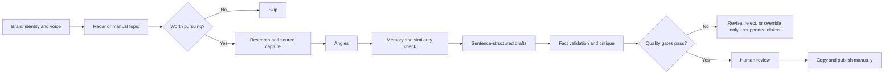
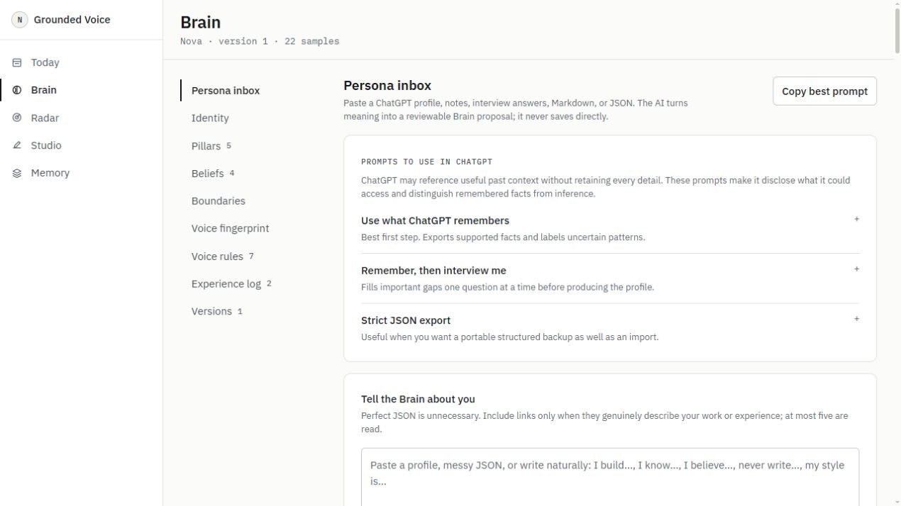
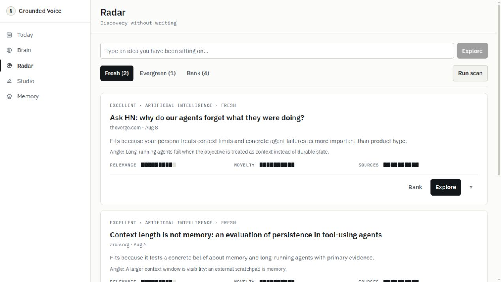
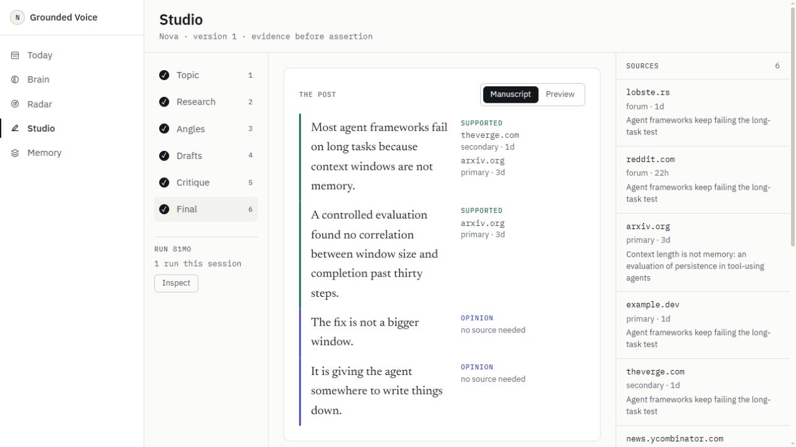
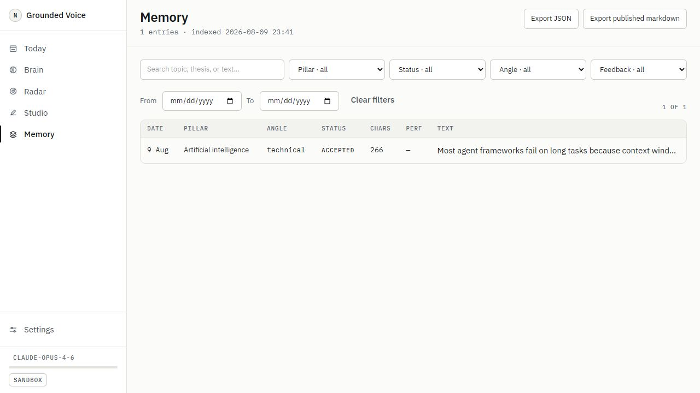
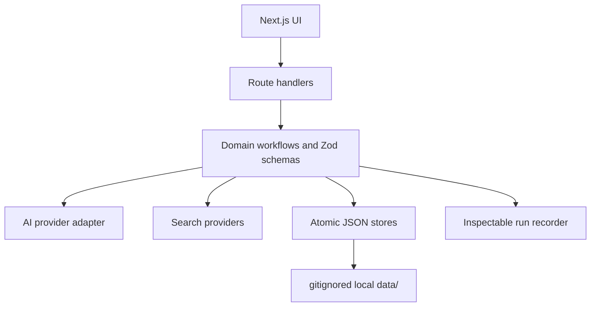

# OwlScope

A local-first writing office that researches ideas, checks evidence and memory, drafts in a defined writing voice, critiques the result, and waits for human approval.

> Release status: pre-release (`0.1.0`). The core local workflow is implemented. See [Known limitations](LIMITATIONS.md) before relying on it.


## Why it exists

Most AI writing tools begin with “write me a post.” OwlScope begins earlier: *is there anything worth saying, does it fit this person, is it supported, and has it already been said?* It is built for writers who care more about a defensible point of view than publishing volume.

The project follows five rules:

1. Identity before generation.
2. Evidence before factual assertion.
3. Memory before repetition.
4. Silence is a valid result.
5. A person approves and publishes every final draft.

OwlScope does not automatically publish to X or any other platform, and it does not autonomously “learn” a new identity from engagement.

## What is implemented

- **Brain** - a structured, versioned persona: identity, audience, weighted pillars, beliefs, boundaries, voice rules, style controls, writing samples, voice fingerprint, and first-hand experience.
- **Radar** - multi-source topic discovery with transparent relevance, novelty, freshness, source-quality, usefulness, angle, claim-risk, and diversity scores.
- **Studio** - a resumable six-stage workflow for topic selection, research, angles, drafts, critique, validation, similarity checks, and final review.
- **Today** - a cached daily run of the same pipeline, including cadence-aware variety and an explicit “nothing worth posting” outcome.
- **Evidence Lock** - sentence-structured drafts with claim type, supporting source IDs, and support status. Unsupported factual claims can block finalisation.
- **Memory** - local search, filters, provenance, prior-post similarity, skip days, rejection feedback, exports, and optional manual performance observations.
- **Inspection and cost controls** - complete structured run records, sandbox fixtures, model routing, token estimates, daily limits, cooldowns, and idempotency.
- **Human-controlled evolution** - repeated feedback can propose narrow persona-slider changes; nothing changes until accepted and versioned.

## How the pipeline works



The stages exchange Zod-validated records rather than one long prompt. The researcher does not write, the critic does not rewrite, model-produced URLs not returned by a search provider are dropped, and chain-of-thought is neither stored nor displayed. See [AI pipeline](docs/AI_PIPELINE.md).

## Screens

| Brain | Radar |
|---|---|
|  |  |
| **Studio** | **Memory** |
|  |  |

The best surfaces to understand the product are Today, Brain, Radar, Studio’s final Evidence Margin, and Memory.

## Architecture

OwlScope is a Next.js application with no database or background service. Server-side domain code writes validated JSON under `data/`; React components and route handlers do not access the filesystem directly.



- Atomic writes use temporary files followed by rename.
- Reads are schema-validated; corrupt files are quarantined under the derived cache.
- User-supplied URLs pass an SSRF guard with DNS checks, redirect checks, timeouts, and body limits.
- The app binds to `127.0.0.1` and has no authentication. Do not expose it to a network or tunnel.

See [Architecture](docs/ARCHITECTURE.md) for module boundaries, storage collections, and trust boundaries.

## Tech stack

- Next.js 16, React 19, TypeScript 5.9
- Zod 4 for persisted and model-output contracts
- Tailwind CSS 4 with a small token-based design system
- Vitest for domain, provider, storage, integration, and deterministic eval coverage
- Local JSON files; no SQL database, vector database, queue, telemetry, or analytics SDK

## Getting started

### Prerequisites

- Node.js 20.9 or newer
- npm
- No database or external account for sandbox mode

### Install and run in sandbox mode

```bash
git clone <your-fork-url>
cd owlscope
npm install
cp .env.example .env
```

Set `SANDBOX_MODE=true` in `.env`, then run:

```bash
npm run dev
```

Open `http://127.0.0.1:3000`, go to Brain, and load the included Nova demo persona or create your own. Sandbox mode uses checked-in fixtures and makes no provider or research network calls.

On Windows PowerShell, use `Copy-Item .env.example .env` instead of `cp`.

### Run with an AI provider

The shipped adapter targets Anthropic’s Messages API. Add an API key and model names to `.env`, or configure model names in Settings:

```dotenv
AI_PROVIDER=anthropic
AI_API_KEY=your-provider-key
AI_MODEL_STRONG=claude-opus-4-6
AI_MODEL_FAST=claude-haiku-4-5-20251001
SANDBOX_MODE=false
```

`AI_BASE_URL` can point to DeepSeek’s Anthropic-compatible endpoint; the adapter contains explicit handling for its structured-output behavior. Other provider protocols are not implemented.

## Environment variables

| Variable | Required | Purpose |
|---|---:|---|
| `AI_PROVIDER` | Real mode | Must currently be `anthropic`. |
| `AI_API_KEY` | Real mode | Server-only provider credential. |
| `AI_MODEL_STRONG` | No | Overrides the strong model saved in Settings. |
| `AI_MODEL_FAST` | No | Overrides the fast model saved in Settings. |
| `AI_BASE_URL` | No | Anthropic API by default; supports the DeepSeek-compatible endpoint. |
| `SANDBOX_MODE` | No | `true` forces all AI/search work to checked-in fixtures. |
| `GITHUB_TOKEN` | No | Raises GitHub Radar search limits. |
| `REDDIT_CLIENT_ID` / `REDDIT_CLIENT_SECRET` | No | Enables Reddit OAuth; anonymous access remains available. |
| `REDDIT_USER_AGENT` | No | Identifies Reddit requests. |
| `DATA_DIR` | No | Overrides the local data directory. |
| `FIXTURES_DIR` | No | Overrides the sandbox fixture directory. |
| `LOG_LEVEL` | No | `debug`, `info`, `warn`, or `error`. |
| `GIT_SYNC_DATA` | No | Opts into private-repository data sync. Disabled by default. |

`.env.example` contains placeholders only. Never commit `.env`.

## Research configuration

Radar can use native model web search, Hacker News, Reddit, arXiv, GitHub, DEV Community, Lobsters, OpenAlex, and custom RSS/Atom feeds. Every feed provider except native model search works without an AI key. GitHub and Reddit credentials are optional reliability/rate-limit improvements.

Providers, query settings, thresholds, and weights are configured under Settings. A provider failure is reported as degraded and does not cancel successful providers.

Manual URLs pasted into Brain or Studio are fetched server-side through the SSRF guard. Sites that require JavaScript rendering may not yield readable text.

## Persona configuration

Brain supports three entry paths: a guided interview/onboarding flow, a reviewed prose or JSON import, or the Nova demo. Imported material is additive and cannot reach disk until reviewed and saved. Voice fingerprints combine deterministic measurements from real samples with bounded qualitative model analysis; profile prose alone never invents a fingerprint.

Every accepted Brain change creates a full, restorable persona version. Feedback may tune topic selection and propose narrow slider changes, but only explicit saves change identity.

## Data and database setup

There is no database setup. Runtime state is created automatically under `data/`, one JSON file per record where practical. `data/` is gitignored because it contains private identity, prompts, sources, drafts, and history.

Use Settings → Export all as zip for backups. Git data sync is intentionally disabled in public checkouts; set `GIT_SYNC_DATA=true` only when both the checkout and remote are private. Enabling it force-adds `data/` by design.

## Project structure

```text
src/app/             pages and route handlers
src/components/      UI by product area plus shared primitives
src/domain/          schemas, scoring, gates, and workflow rules
src/services/ai/     provider adapter and sandbox provider
src/services/search/ research and Radar providers
src/services/storage atomic JSON storage, caches, export, quarantine
src/services/        orchestration, similarity, runs, and sync
src/evals/           deterministic offline behavior cases
fixtures/            sandbox provider/search responses
data/                private local runtime state (gitignored)
docs/                architecture and pipeline documentation
```

## Development

```bash
npm run typecheck
npm run lint
npm test
npm run eval
npm run build
```

`npm run eval` executes eleven named, offline safety behaviors and fails with the assertion name. Add a regression case when fixing a pipeline or gate failure. The component gallery is available at `/inspect/components`; structured run records are at `/inspect`.

## Current limitations

- One user and one local process only; there is no authentication or cross-process job coordinator.
- The only first-class AI protocol is Anthropic’s Messages API.
- RSS parsing and webpage text extraction intentionally cover conventional server-rendered content.
- Similarity is local lexical/trigram analysis plus bounded model review, not embedding search.
- Performance observations are manually entered correlations and never drive selection automatically.
- Persona evolution is experimental and limited to reviewed numeric slider proposals.
- Browser/component behavior is manually verified; automated component and end-to-end UI tests are not yet present.

The cumulative engineering notes are in [LIMITATIONS.md](LIMITATIONS.md).

## Roadmap

Planned public-release work, not current functionality:

- automated component and browser regression coverage;
- a first-class second AI provider adapter;
- stored user edit-diff feedback;
- stronger article extraction for JavaScript-heavy pages;
- additional platform previews and exports without automatic publishing.

## Contributing

See [CONTRIBUTING.md](CONTRIBUTING.md). Small, test-backed changes that preserve evidence, identity, privacy, and human-control invariants are preferred over broad rewrites.

## Security

Read [SECURITY.md](SECURITY.md) before reporting a vulnerability. Do not include API keys, persona data, prompts, run records, or private sources in a public issue.

## License

No license has been selected yet. Until a license file is added, the repository is **not yet legally open source**, even if its source is visible. A license will be added only after the maintainer chooses one.

## Acknowledgements

OwlScope uses IBM Plex Sans, IBM Plex Mono, and Newsreader. Radar integrates public interfaces from Hacker News, Reddit, arXiv, GitHub, DEV Community, Lobsters, and OpenAlex; each remains subject to its operator’s availability and terms.
