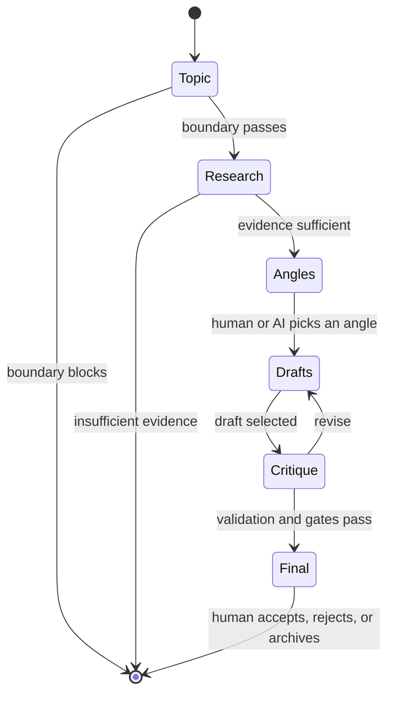

# AI pipeline

OwlScope separates discovery, research, writing, judgment, and publishing state. This is both a quality choice and a security boundary: each model stage receives only the context it needs and returns a narrow validated record.

## Shared invariants

- The active persona version is loaded before generation.
- Current factual claims require retrieved evidence.
- Prior content is checked before a candidate is accepted.
- No stage may invent a source URL or first-hand experience.
- A skip is a successful result when evidence or quality is insufficient.
- The human owns identity changes and publishing decisions.

## Discovery: Radar

1. Build interleaved search terms from enabled persona pillars, subtopics, beliefs, and configured overrides.
2. Query enabled providers concurrently: native model search, Hacker News, Reddit, arXiv, GitHub, DEV Community, Lobsters, OpenAlex, and RSS/Atom.
3. Deduplicate candidates transitively by canonical URL and normalized title.
4. Run free L1/L2 novelty checks against content history before model scoring.
5. Generate bounded evergreen ideas; a degraded model falls back to pillar-derived prompts.
6. Use the fast model for persona relevance, claim risk, pillar assignment, and fit explanation.
7. Use the strong model for at most five finalists’ usefulness and angle strength.
8. Apply configured weights and threshold; store ready/banked topics or return a skip explanation.

Scores are heuristics, not probabilities. Public-provider availability, rate limits, and ranking behavior remain outside the application’s control.

## Studio stages

### Topic and boundaries

Fixed English keyword rules catch obvious exclusions cheaply, followed by a bounded classifier for ambiguous topics. A blocked topic never reaches research or writing.

### Research

The researcher gathers sources and returns facts, inferences, uncertainties, freshness, and an insufficiency decision-not prose for publication. Native model search keeps tool-returned URLs separate from model summaries and drops any URL not present in the tool results. Manual URLs pass the SSRF guard and readable-text extractor.

### Angles

The model proposes typed angles with a thesis, fit explanation, evidence requirements, novelty risk, and kind. If the system chooses, its reason is stored. Today can use recent cadence as a soft tie-breaker; cadence cannot override evidence or quality thresholds.

### Drafts and Evidence Lock

Each draft is an ordered sentence array plus a flattened copy. Every sentence carries a claim type, source IDs, and support status. The schema verifies that joining the sentence array exactly recreates the flattened text. Character counts and sentence IDs are recomputed in code.

### Fact validation, critique, and similarity

- Fact validation checks sentence support against stored source excerpts.
- The critic reports persona fit, genericness, factual risk, typed issues, and accept/revise/reject; its schema has no rewritten-post field.
- Mechanical voice checks compare length, openings, vocabulary, punctuation, emoji, hashtag, and persona switches against the fingerprint.
- Similarity uses stemmed-token Jaccard, character-trigram cosine (including openings), then an optional fast-model judgment over at most eight nearest prior items.

Blocking gates include unsupported facts, high similarity, boundary violations, fabricated experience, materially inconsistent voice, stale information presented as current, and critic rejection. Warnings remain non-blocking. Only unsupported-claim findings can be overridden, and the affected sentence IDs are recorded.

## Today

Today runs Radar and Studio through the same public services, not a simplified hidden prompt. A single run recorder spans the day’s executed stages. The result is cached by date and is one of:

- a reviewable content recommendation;
- a counted skip with reasons;
- a persisted failure checkpoint that can be retried.

Improve and Shorten use Studio’s revision service and do not silently replace already accepted content.

## Memory and feedback

Memory builds a validated derived index from content, topics, sources, skip days, feedback, and persona labels. Search and filters are local. Rejection feedback influences selection summaries; optional metrics produce descriptive observations only after enough samples. Evolution requires at least fifteen feedback events and produces a reviewable numeric proposal. It never edits beliefs, boundaries, rules, or identity autonomously.

## Providers and sandbox

The first-class adapter uses Anthropic’s Messages API for open and structured completions plus server-side web search. A specific DeepSeek Anthropic-compatible path disables thinking for schema-bound calls and requests typed tool input. Other protocols are not implemented.

Sandbox mode replaces AI and search calls with checked-in fixtures, performs zero external network requests, and is the supported path for tests and evaluation.
