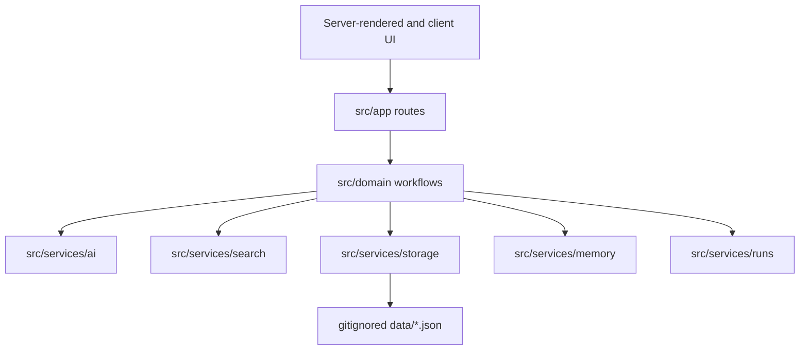

# Architecture

Grounded Voice is a single-user Next.js application designed to run on `127.0.0.1`. It has no authentication, database, worker process, queue, telemetry service, or automatic publisher.

## Module boundaries

- `src/app/` contains pages and thin HTTP handlers.
- `src/components/` contains product-area UI and common accessible primitives.
- `src/domain/` owns Zod schemas, deterministic rules, scoring, state transitions, and workflow composition.
- `src/services/ai/` owns the provider interface, the Anthropic-shaped adapter, retries, structured-output repair, pricing estimates, and sandbox provider.
- `src/services/search/` owns native model search, guarded manual URLs, feed providers, fixtures, and readable-text extraction.
- `src/services/storage/` is the only application layer allowed to import Node filesystem APIs; ESLint enforces this boundary.
- `src/services/runs/` stores prompts, provider responses, parsed structured output, validation errors, usage, latency, and estimated cost. It has no chain-of-thought field.

## Data model

Runtime state lives under `DATA_DIR` or `./data`:

| Collection | Contents |
|---|---|
| `settings.json` | Models, budget, theme, Radar configuration, and sync timestamps. |
| `persona/` | Current persona, samples, fingerprint, experience, versions, and evolution proposals. |
| `topics/` | Manual and Radar-discovered topics with status and scores. |
| `sources/` | Retrieved source metadata and excerpts. |
| `studio/` | Resumable in-progress Studio sessions. |
| `content/` | Finalised content records and publishing state. |
| `runs/` | Inspectable execution traces. |
| `feedback/` | Radar and Today rejection feedback. |
| `metrics/` | Optional manually entered observations. |
| `exports/` | Generated portable exports. |
| `.cache/` | Rebuildable indexes, fetched pages/feeds, Today records, and quarantine. |

The project uses `createJsonStore<T>` for validated reads and atomic writes. Invalid records are moved to quarantine with a reason instead of being silently dropped. A single in-process queue serialises writes; this is correct only for the supported one-process deployment.

## Trust boundaries

### Browser to server

Provider credentials are read only in server code and are excluded from public settings responses. Destructive data routes repeat confirmation checks server-side. Because there is no authentication, binding to localhost is a security boundary rather than a convenience.

### Network retrieval

User-provided URLs use `safeFetch`: only HTTP(S), DNS resolution before every hop, private/loopback/link-local address rejection, three redirects, a ten-second timeout, and a two-megabyte response cap. Authorization and cookie headers are stripped on cross-origin redirects.

Radar’s fixed public providers use the same capped fetch path where credentials or feed bodies are involved. Individual provider failures degrade independently.

### Model output

Structured stages parse against Zod schemas. The normal adapter allows one repair attempt; a second invalid result fails loudly. Countable values-character count, sentence IDs, voice statistics, similarity vectors, and score aggregation-are computed in code.

### Publishing

Content status is a server-enforced state machine. Generation does not imply acceptance, copying does not imply publishing, and only an explicit action records `publishedAt` and an optional public URL. No platform publishing API is implemented.

## Caching and concurrency

Derived indexes are disposable and keyed by source metadata signatures. Feed and page caches have bounded lifetimes. Today uses an in-process lock plus a persisted day record so concurrent browser requests attach to one job; a process restart resumes from persisted checkpoints but cannot resume a provider completion mid-request.

## Private data policy

`data/` is ignored by default. It contains identity records, writing samples, prompts, raw provider responses, research URLs, and publishing history. The optional Git sync path is gated by `GIT_SYNC_DATA=true` and is appropriate only when both the checkout and its remote are private.
